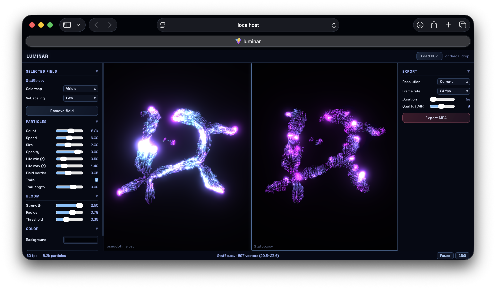

# luminar

**2D vector field particle flow visualization** with bloom effects, powered by Three.js.

A particle-flow visualization inspired by the bloom-heavy aesthetic of [lumap](https://github.com/brandonlukas/lumap). Features dual-field rendering, spatial grid optimization for large datasets, real-time controls, and WebM recording.



## Features

- 🎨 **Dual vector fields** - Load and visualize two CSV vector fields side-by-side with independent colors
- 🚀 **High performance** - Spatial grid optimization handles 5000+ field points at 60 FPS
- 🎬 **Built-in recording** - Export as WebM video up to 4K resolution
- 🎛️ **Real-time controls** - Adjust particle count, speed, bloom, colors, trails, and more
- 📂 **Drag & drop** - Drop CSV files directly into the browser to load fields
- 🌈 **8 color presets** - From luminous violet to electric lime
- ✨ **Bloom & trails** - Unreal Bloom post-processing with optional motion trails

## Quick Start

**Local development** (recommended):

```sh
git clone https://github.com/brandonlukas/luminar.git
cd luminar
npm install
npm run dev
```

Visit http://localhost:5173 and drag your CSV files onto the left or right side of the canvas to load Field A or Field B.

## CSV Format

Your CSV should have four columns: `x`, `y`, `dx`, `dy` (position x, position y, velocity x, velocity y). Headers are optional and auto-detected.

**Example with header:**
```csv
x,y,dx,dy
0.0,0.0,1.2,0.5
0.5,0.0,1.1,0.6
1.0,0.0,0.9,0.7
```

**Example without header (whitespace-separated also supported):**
```csv
0.0  0.0  1.2  0.5
0.5  0.0  1.1  0.6
1.0  0.0  0.9  0.7
```

## Recording Video

1. Click **Controls** button (top-right)
2. Scroll to **Export (WebM)** section
3. Choose resolution: Current window, 1080p, 1440p, or 4K
4. Choose duration: 3s, 5s, 10s, or 15s
5. Click **⏺ Start recording**
6. WebM file downloads automatically when complete

**Convert to GIF or MP4:**
```sh
# GIF (30fps, 720p width)
ffmpeg -i luminar.webm -vf "fps=30,scale=720:-1:flags=lanczos" -loop 0 luminar.gif

# MP4 (h264)
ffmpeg -i luminar.webm -c:v libx264 -preset slow -crf 18 luminar.mp4
```
