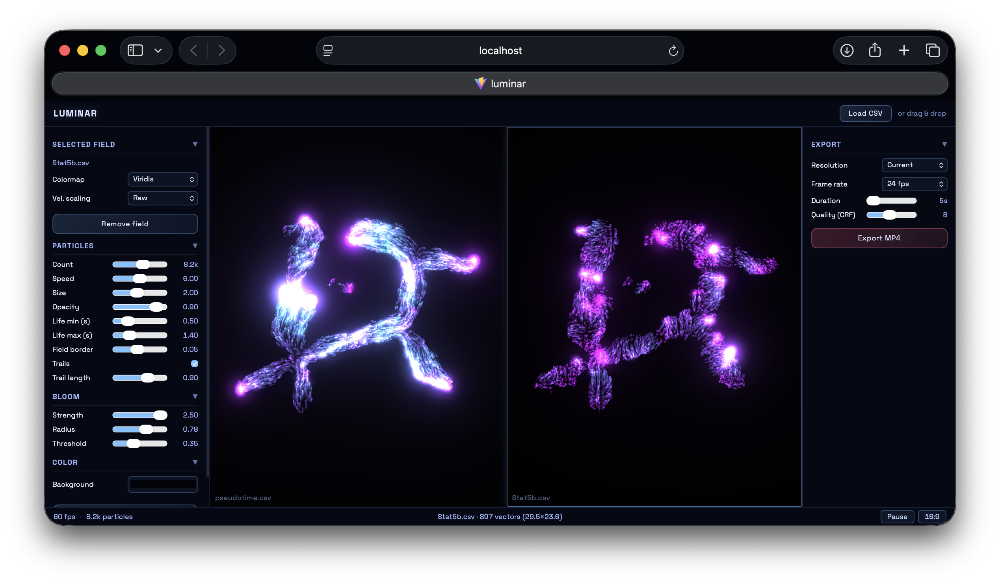

# luminar

2D vector field particle flow visualization with bloom effects, powered by Three.js.



## Installation

```sh
git clone https://github.com/brandonlukas/luminar.git
cd luminar
npm install
npm run dev
```

Open http://localhost:5173.

## Quick Start

Load a CSV using the "Load CSV" button in the top bar, or drag and drop a file anywhere on the page. You can load up to two fields for side-by-side comparison.

Your CSV should have four columns -- `x`, `y`, `dx`, `dy` (position and velocity). Headers are optional.

```csv
x,y,dx,dy
0.0,0.0,1.2,0.5
0.5,0.0,1.1,0.6
1.0,0.0,0.9,0.7
```

Whitespace-separated values also work:

```
0.0  0.0  1.2  0.5
0.5  0.0  1.1  0.6
1.0  0.0  0.9  0.7
```

Adjust particles, bloom, colors, and trails in the left sidebar. The right sidebar has export controls. Play/pause and aspect ratio toggles are in the bottom status bar.

## Export

Record an MP4 video directly in the browser (encoded client-side via FFmpeg.wasm). Choose resolution (current, 1080p, or 4K), frame rate, duration, and quality from the right sidebar, then click "Export MP4".
